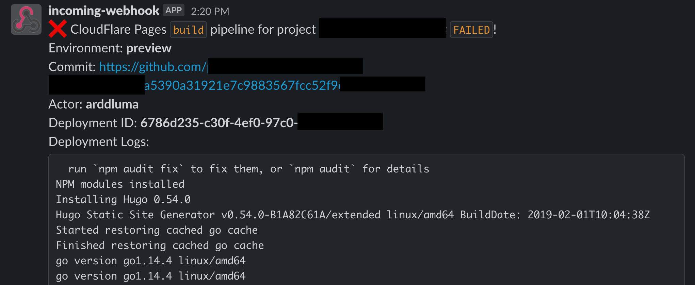
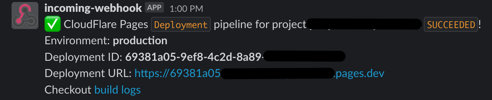

# CloudFlare Pages Slack notification
## Using [CF Pages Await](https://github.com/WalshyDev/cf-pages-await) made by Daniel Walsh [WalshyDev](https://github.com/WalshyDev)

Wait for Cloudflare Pages build to finish and send Slack notification

## Usage
```yml
- name: Await CF Pages and send Slack notification
  uses: arddluma/cf-pages-slack-notification@v2
  with:
    accountEmail: ${{ secrets.CF_ACCOUNT_EMAIL  }}
    apiKey: ${{ secrets.CF_API_KEY  }}
    accountId: ${{ secrets.CF_ACC_ID  }}
    # CloudFlare Pages project name
    project: ${{ secrets.CF_PAGES_PROJECT  }}
    # Add this if you want GitHub Deployments (see below)
    githubToken: ${{ secrets.GITHUB_TOKEN }}
    # Create Slack Incoming webhook and add as variable https://hooks.slack.com/...
    slackWebHook: ${{ secrets.SLACK_WEBHOOK  }}
    # Add this if you want to wait for a deployment triggered by a specfied commit
    commitHash: ${{ steps.push-changes.outputs.commit-hash }}
```

### Example
```yml
name: Deploy
on: push
jobs:
  build:
    runs-on: ubuntu-latest
    steps:
    - uses: actions/checkout@v2
    - name: Await CF Pages and send Slack notification
      id: cf-pages
      uses: arddluma/cf-pages-slack-notification@v2
      with:
        accountEmail: ${{ secrets.CF_ACCOUNT_EMAIL  }}
        apiKey: ${{ secrets.CF_API_KEY  }}
        accountId: ${{ secrets.CF_ACC_ID  }}
        # CloudFlare Pages project name
        project: ${{ secrets.CF_PAGES_PROJECT  }}
        # Create Slack Incoming webhook and add as variable https://hooks.slack.com/...
        slackWebHook: ${{ secrets.SLACK_WEBHOOK  }}
        # Add this if you want GitHub Deployments (see below)
        githubToken: ${{ secrets.GITHUB_TOKEN }}
```

## Screenshots

### If build phase fails:

  

### If deployment phase is successful:

  

## Outputs
* `id`          - Deployment ID, example: `50ff553c-da5d-4846-8188-25ae82a3bb7d`
* `environment` - Envrionment for this deployment, either `production` or `preview`
* `url`         - URL for this deployment
* `alias`       - Alias URL (Will be the branch URL such as `fix-issue.project.pages.dev` or be the deployment URL)
* `success`     - If the deployment was successful

## GitHub Deployments
GitHub Deployments will show if the deployment was successful or failed right inside GitHub! You can easily see the status, view the website (exact deployment) and see the logs.

> **Note**: You need to add the `githubToken` input in order for deployments to work!

### Overview


### Pull Requests
**In Progress**


**Successful**

